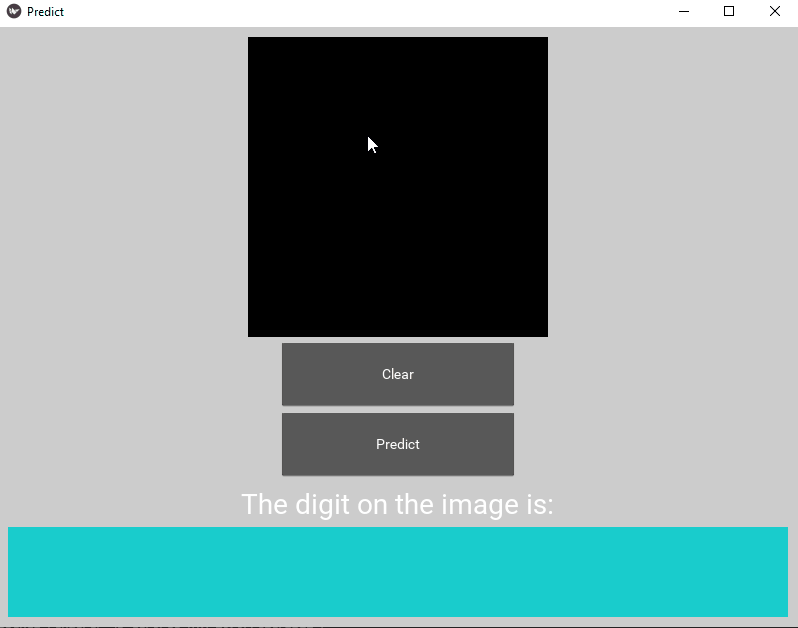

# mnistApp
A simple digit recognition desktop app. 

## Introduction
The objective of this project was to learn to implement a trained machine learning model into a simple desktop application. 
A multilayer perceptron model is trained on the MNIST dataset and then is used to make inference. The model is a `MLPClassifier`
of `Scikit-learn` and the GUI is created using `Kivy`.

## Setup
### Requirements
- Python 3.7
- conda
### Install dependencies
```
conda env create -f environment.yml
```

## Usage
Activate the conda environment:
```
conda activate mnistApp
```

Launch the app:
```
python predict_main.py
```

On the app:
1. Draw on the canvas using your mouse
2. Click the `Predict` button to make inference
3. Click the `Clear` button to clear the canvas.

Note: The model is not very robust because it is a simple multilayer perceptron.
## Demo 

